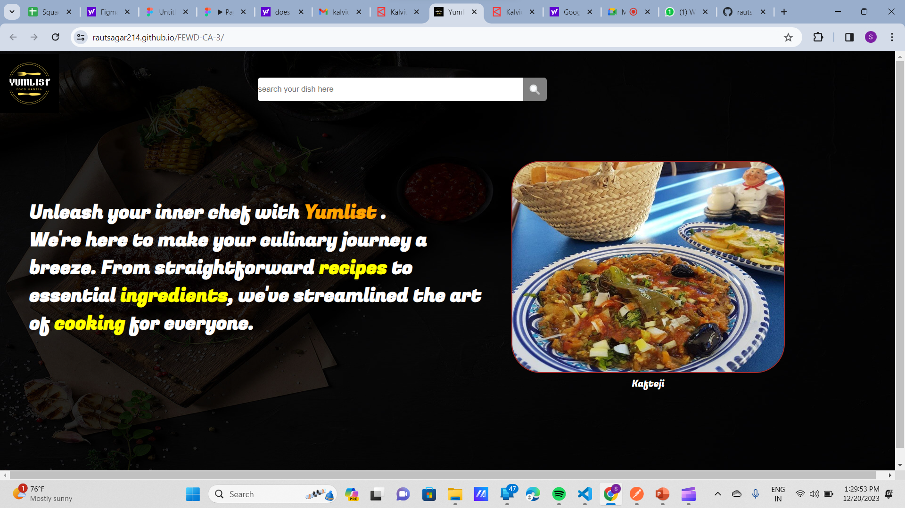
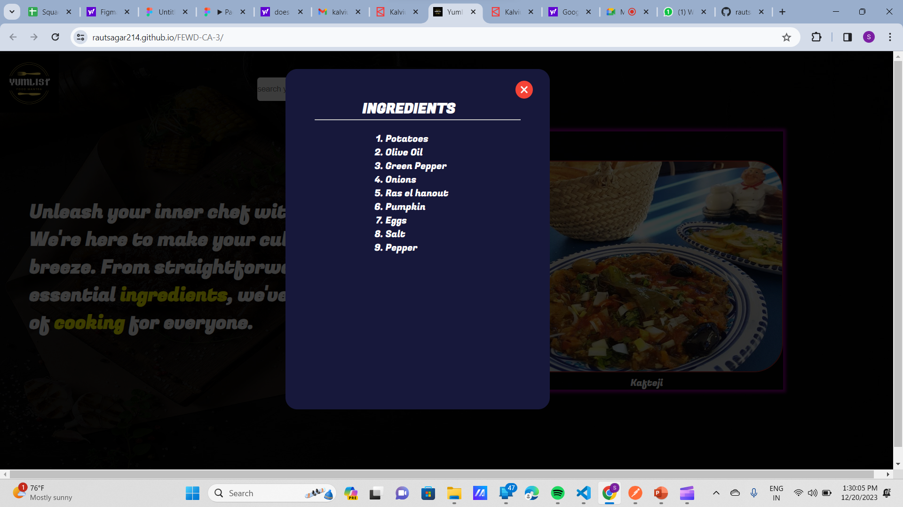

# FEWD-CA-3

I made this website using html css and javascript .
This website is use for knowing recipes of the dishes and also the ingredients .
The first page is the menu page including logo search bar , about website and the random dishes is there .
When you click on the random image the ingredients is display on your screen .
when you search the food in the search bar the food display  on the screen . 
In this website   i am fetching the data from  api from the mealdb.io and using it in website . 

# reference 
I took icons from flaticon 
I took api from mealdb.io 

# screen shots 
 
 
 